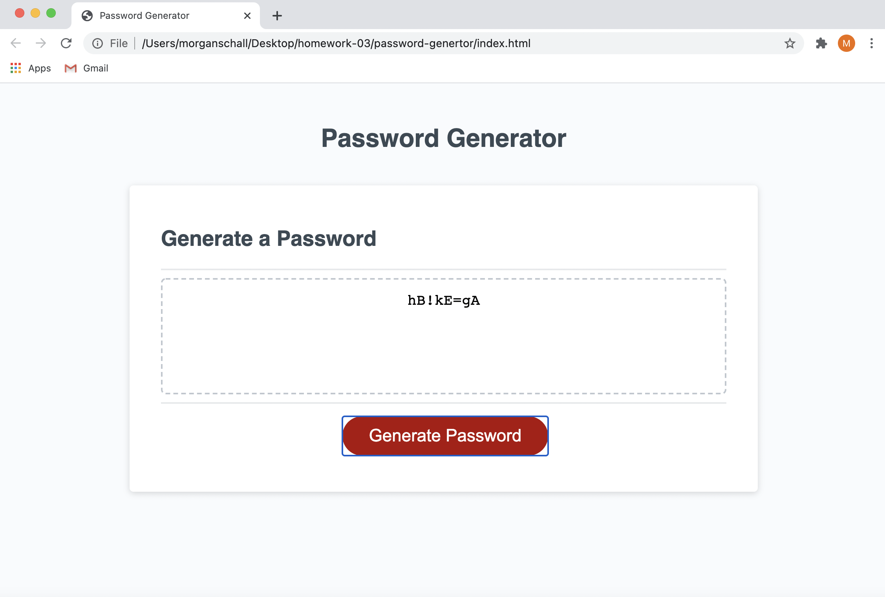

# password-genertor
This is an assignment that looks at the javascript code behind random password generators. 

## Table of Contents

- [Installation](#installation)
- [Usage](#usage)
- [Screenshot](#screenshot)
- [Support](#support)
- [Contributing](#contributing)

## Installation

View my project at https://mschall217.github.io/password-genertor/

## Usage

This project was all about taking an existing HTML/CSS file and using javascript to make it run as designed! This project can be used to help any user generate a password depending on basic commonly asked for criteria in any passowrd. 

## Screenshot 

## Support

Please [open an issue](https://github.com/mschall217/password-genertor/issues) for support.

## Contributing

If I could make youtube a partner here I would! 
My tutor and TA's also guided me a lot in some things to look up and consider. 